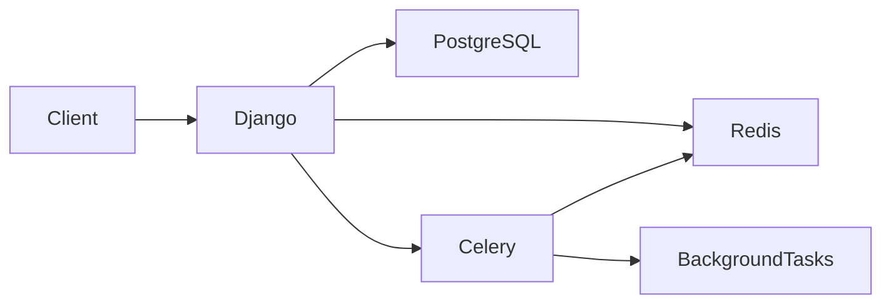
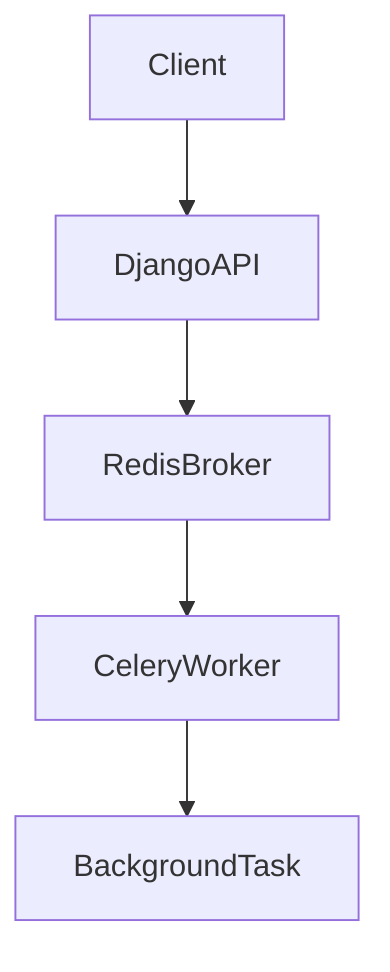

# Aforro Store Management API

A backend REST API built with **Django** and **Django REST Framework** for managing products, stores, inventory, and customer orders. Developed as a backend engineering assignment, it demonstrates transactional order processing, search, Redis caching, asynchronous task processing, Docker, PostgreSQL, and automated testing.

## Table of Contents

- [Features](#features)
- [Tech Stack](#tech-stack)
- [Architecture](#architecture)
- [Project Structure](#project-structure)
- [Quick Start](#quick-start)
- [Docker](#docker)
- [API Reference](#api-reference)
- [Usage Examples](#usage-examples)
- [Redis Caching](#redis-caching)
- [Celery Background Tasks](#celery-background-tasks)
- [Design Decisions](#design-decisions)
- [Scalability Considerations](#scalability-considerations)
- [Testing](#testing)
- [Author](#author)

---

## Features

| Category | Capabilities |
|----------|--------------|
| **Core** | Product, category, store, and inventory management |
| **Orders** | Transaction-safe order processing with automatic inventory validation and stock deduction |
| **Search** | Product search with multiple filters, autocomplete suggestions, and pagination |
| **Performance** | Redis response caching and Celery background task processing |
| **DevOps** | Dockerized development environment with PostgreSQL |
| **Tooling** | Swagger / OpenAPI documentation, dummy data generator, automated API tests |

---

## Tech Stack

| Layer | Technologies |
|-------|--------------|
| **Language** | Python 3.12 |
| **Framework** | Django, Django REST Framework |
| **Database** | PostgreSQL |
| **Cache / Broker** | Redis |
| **Task Queue** | Celery |
| **Infrastructure** | Docker, Docker Compose |
| **Documentation** | drf-spectacular (Swagger / OpenAPI) |
| **Testing / Seeding** | Faker |

---

## Architecture



| Service | Role |
|---------|------|
| **Django Web Server** | REST API and request handling |
| **PostgreSQL** | Primary relational data store |
| **Redis** | Response caching and Celery message broker |
| **Celery Worker** | Asynchronous background task execution |

---

## Project Structure

```text
aforro/
├── apps/
│   ├── products/          # Product and category models, seed command
│   ├── stores/            # Store and inventory management
│   ├── orders/            # Order processing, services, Celery tasks
│   └── search/            # Product search and autocomplete
├── tests/                 # Integration tests
├── aforro/                # Django project settings, URLs, Celery config
├── Dockerfile
├── docker-compose.yml
├── requirements.txt
├── manage.py
└── readme.md
```

---

## Quick Start

### Prerequisites

- [Docker](https://docs.docker.com/get-docker/) and Docker Compose
- Git

### 1. Clone the repository

```bash
git clone https://github.com/NikhilAmbure/Aforro_backend
cd Aforro_backend
```

### 2. Configure environment variables

Create a `.env` file in the project root:

```env
SECRET_KEY=your-secret-key
DEBUG=True

DB_NAME=aforro
DB_USER=postgres
DB_PASSWORD=postgres
DB_HOST=db
DB_PORT=5432

REDIS_URL=redis://redis:6379/0
```

### 3. Build and start services

```bash
docker compose up --build
```

### 4. Apply database migrations

```bash
docker compose exec web python manage.py migrate
```

### 5. Seed dummy data

```bash
docker compose exec web python manage.py seed_data
```

The seed command generates:

- 10+ categories
- 1000+ products
- 20+ stores
- Inventory records for every store

### 6. Access the API

| Resource | URL |
|----------|-----|
| API base | `http://localhost:8000/api/` |
| Swagger UI | `http://localhost:8000/api/docs/` |
| OpenAPI schema | `http://localhost:8000/api/schema/` |

---

## Docker

### Common commands

| Action | Command |
|--------|---------|
| Start all services | `docker compose up` |
| Start with rebuild | `docker compose up --build` |
| Stop containers | `docker compose down` |

### Services

Docker Compose starts four services:

| Service | Description |
|---------|-------------|
| `web` | Django development server on port 8000 |
| `db` | PostgreSQL 16 |
| `redis` | Redis 7 |
| `celery` | Celery worker for background tasks |

---

## API Reference

### Orders

| Method | Endpoint | Description |
|--------|----------|-------------|
| `POST` | `/api/orders/` | Create a new order |
| `GET` | `/api/orders/` | List orders |

### Stores

| Method | Endpoint | Description |
|--------|----------|-------------|
| `GET` | `/api/stores/<store_id>/inventory/` | Get inventory for a store |

### Search

| Method | Endpoint | Description |
|--------|----------|-------------|
| `GET` | `/api/search/products/` | Search products with optional filters |
| `GET` | `/api/search/suggest/` | Autocomplete product suggestions |

---

## Usage Examples

### Create an order

**POST** `/api/orders/`

```json
{
  "store_id": 1,
  "items": [
    {
      "product_id": 10,
      "quantity_requested": 2
    },
    {
      "product_id": 15,
      "quantity_requested": 1
    }
  ]
}
```

### Search products

```http
GET /api/search/products/?q=laptop
```

### Search with filters

```http
GET /api/search/products/?category=Electronics&min_price=1000&max_price=50000
```

### Product suggestions

```http
GET /api/search/suggest/?q=lap
```

### Store inventory

```http
GET /api/stores/1/inventory/
```

---

## Redis Caching

Redis caches frequently requested API responses to reduce database load and improve response times.

| Endpoint | TTL |
|----------|-----|
| Product Search (`/api/search/products/`) | 5 minutes |
| Product Suggestions (`/api/search/suggest/`) | 5 minutes |

---

## Celery Background Tasks

Celery handles long-running work outside the HTTP request cycle so API responses stay fast.

**Current implementation:** order confirmation runs asynchronously after a successful order is created.



---

## Design Decisions

- **Service layer** — Business logic lives outside views in dedicated service modules.
- **Atomic transactions** — Order creation uses `transaction.atomic()` for consistency.
- **Inventory locking** — `select_for_update()` prevents race conditions during concurrent orders.
- **Atomic updates** — Django `F()` expressions for safe inventory decrement.
- **Caching** — Redis reduces repeated queries on high-traffic search endpoints.
- **Async processing** — Celery offloads post-order work from the request thread.
- **Modular apps** — Separate Django apps for products, stores, orders, and search.
- **Auto-generated docs** — drf-spectacular provides always-up-to-date OpenAPI specs.
- **Reproducible environment** — Docker Compose standardizes local development.

---

## Scalability Considerations

The architecture supports growth through:

- **Modular structure** — Independent apps simplify parallel development and deployment.
- **Redis caching** — Offloads read-heavy search traffic from PostgreSQL.
- **Celery workers** — Background tasks scale horizontally without blocking HTTP requests.
- **Transactional integrity** — Database transactions and row-level locking prevent overselling under concurrency.
- **Containerized deployment** — Docker enables consistent environments from dev to production.
- **PostgreSQL** — Production-ready relational backend with strong consistency guarantees.
- **Future extensions** — Multiple Celery workers, load balancing, and distributed caching can be added for higher traffic.

---

## Testing

Run the full test suite inside the web container:

```bash
docker compose exec web python manage.py test
```

### Test coverage

| Test | Validates |
|------|-----------|
| Order creation (confirmed) | Successful order flow with stock deduction |
| Order creation (rejected) | Insufficient inventory handling |
| Inventory API | Store inventory retrieval |
| Product search API | Search and filter behavior |
| Product suggestion API | Autocomplete responses |

---

## Author

**Nikhil Ambure** — Backend Developer
